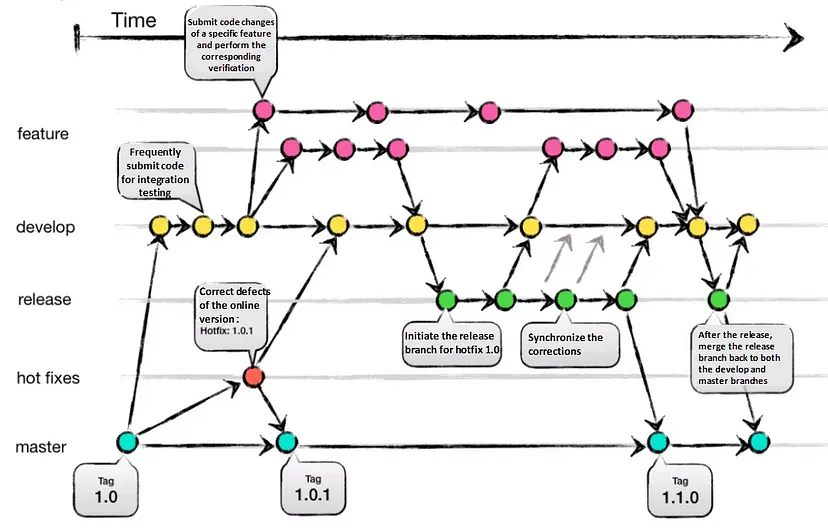

# T4: Continuous Integration
## Was ist Continuous Integration (CI) und wie wird es umgesetzt?
CI ist eine Methode, bei der Entwickler Änderungen regelmäßig in ein zentrales Repository integrieren. Automatisierte Tests und Builds werden durchgeführt, um Fehler frühzeitig zu erkennen und zu beheben. Tools wie Jenkins oder GitLab CI/CD unterstützen die Umsetzung

### Vor- und Nachteile von CI
- **Vorteile:**
    - Frühzeitige Fehlererkennung
    - Höhere Code-Qualität
    - Schnellere Bereitstellung

- **Nachteile:**
    - Hoher Initialaufwand für Einrichtung
    - Teamkultur muss angepasst werden
    - Kosten für Wartung und Skalierung

## Was ist Continuous Testing und wie wird es umgesetzt?
Continuous Testing ist die automatisierte Durchführung von Tests in allen Entwicklungsphasen, um kontinuierlich Feedback zur Softwarequalität zu geben. Es umfasst Unit-, Integrations- und End-to-End-Tests, die in CI/CD-Pipelines integriert sind

## **Was ist eine Branching Strategie und welches sind die bekannten?**
Eine Branching-Strategie legt fest, wie Code-Änderungen in einem Versionskontrollsystem organisiert und verwaltet werden. Ziel ist es, die Zusammenarbeit zwischen Entwicklern zu erleichtern, Konflikte zu minimieren und die Codequalität zu sichern. Branching-Strategien sind besonders in Teams mit mehreren Entwicklern wichtig, um parallele Arbeiten effizient zu koordinieren.
#### *quellen:*
- [gitkraken.com](https://www.gitkraken.com/learn/git/best-practices/git-branch-strategy)
- [medium.com](https://medium.com/@sreekanth.thummala/choosing-the-right-git-branching-strategy-a-comparative-analysis-f5e635443423)
---

### 1. Git-Flow
Die Git-Flow Strategie deckt viele anwendungszwecke ab.
Bei der Verwendung der Strategie, werden verschiedene Branches für bestimmte Zwecke erstellt.

- **Vorteil:**
Klare Trennung zwischen Entwicklungs- und Produktionscode.

- **Nachteil:**
Komplexität steigt mit Projektgröße.

- **Einsatz:**
Ideal für große Projekte mit mehreren Entwicklungsphasen.

### 2. Feature Branching
Jede Funktion oder Aufgabe wird in einem separaten Branch entwickelt.

- **Vorteil:**
Isoliert Änderungen, reduziert Konflikte.
- **Nachteil:**
Kann viele Branches erzeugen, die schwer zu verwalten sind.
- **Einsatz:**
Oft in agilen Teams und kleinen Projekten

### 3. GitHub Flow
Eine schlanke Branching-Strategie, die sich auf einfache und schnelle Entwicklungsprozesse konzentriert. Sie ist ideal für Continuous Deployment und agile Projekte.

- **Vorteile:**
Einfach, schnell, und gut für agile Teams.
Fördert Zusammenarbeit durch Pull Requests.
- **Nachteile:**
Wenig geeignet für komplexe Projekte oder mehrere Entwicklungsphasen.

## Wie kann man Commits und Branches mit User Stories verknüpfen?
*spezifisch für GitHub*

### Verknüpfung mit User Stories:

GitHub ermöglicht die direkte Verbindung von Commits und Branches mit User Stories, wenn ein Projektmanagement-Tool wie GitHub Issues oder ein externes System (z. B. Jira) genutzt wird.

### Methoden:
- **Benennung von Branches:**
Branches sollten die ID oder den Titel der User Story enthalten

- **Verknüpfung im Commit-Text:**
GitHub erkennt Verweise auf Issues durch das Präfix #.

  *Das Keyword **closes** schließt verwiesene Issues automatisch, wenn der Commit gemerged wird.*

- **Pull Requests (PR):**
PRs können direkt auf User Stories oder Issues referenzieren, hier auch mit dem Präfix #.

   *Durch das Keyword **Fixes** im Beschreibungstext mit einem Verweis wird das Issue nach Merge des PRs automatisch geschlossen.*

- **Automatisierung mit Workflows:**
GitHub Actions kann verwendet werden, um automatisierte Verknüpfungen oder Benachrichtigungen zu erstellen, z. B. für Benachrichtigungen bei Verknüpfungen zu Jira-Tickets.

### Vorteile:
- **Transparenz:**
Änderungen sind nachvollziehbar mit Anforderungen verknüpft.
- **Effizienz:**
Automatisches Schließen von User Stories spart Zeit.

## Welche Merge Strategien gibt es und wie werden sie umgesetzt?

### Fast-Forward
Ziel-Branch wird direkt aktualisiert.
- **Vorteil:** Linear und übersichtlich.
- **Nachteil:** Branch-Historie geht verloren.

### Three-Way Merge
Erstellt Merge-Commit.
- **Vorteil:** Klarer Merge-Punkt.
- **Nachteil:** Kann unübersichtlich werden.

### Squash and Merge
Kombiniert alle Commits eines Branches in einen.
- **Vorteil:** Saubere Historie.
- **Nachteil:** Commit-Details gehen verloren.

### Rebase
Commits werden auf den Ziel-Branch verschoben.
- **Vorteil:** Lineare Historie.
- **Nachteil:** Risiko bei gemeinsamem Arbeiten (force-push).

### Merge ohne Fast-Forward
Immer Merge-Commit, auch wenn unnötig.
- **Vorteil:** Branch-Struktur bleibt erhalten.
- **Nachteil:** Mehr Merge-Commits.

## Was ist Semantic Versioning und wie wird es umgesetzt?
Semantic Versioning, auch SemVer genannt, ist ein Konzept der Versionsverwaltung, dabei wird die Version mit 3 Nummern angegeben MAJOR.MINOR.PATCH

### MAJOR:
Wird erhöht wenn es eine grundlegende Änderung gibt, die möglicherweise inkompatibel mit älteren Versionen ist.

### MINOR:
Wird erhöht wenn es ein Neues Feature gibt, sollte jeddoch abwärtskompatibel sein.

### PATCH:
Wird erhöht wenn eine Fehlerbehebung hinzugefügt wurde, sollte auch abwärtskompatibel sein.

## Welchen Unterschied haben Mono- und Multirepo (speziell im Zusammenhang mit Microservices)?
### Monorepo:
Ein Repository für alle Services.
- **Vorteile:** Einfachere Abhängigkeiten, bessere Übersicht.
- **Nachteile:** Skalierungsprobleme bei großen Projekten.

### Multirepo:
Ein Repo pro Service.
- **Vorteile:** Isolierte Entwicklung.
- **Nachteile:** Höhere Verwaltungsaufwände

## Was ist eine Artifact-Repository und welche Rolle spielt es in Ihrem Prozess?
Ein Artifact-Repository speichert Binärdateien wie Builds, Bibliotheken oder Container-Images. Tools wie Nexus oder Artifactory ermöglichen die Wiederverwendung und Versionierung dieser Dateien, was essenziell für CI/CD-Pipelines ist

Bei unserem Prozess ist es wichtig für cd.

---
---

# Zusammenfassung (erstellt mit ChatGPT)
## Continuous Integration (CI):
Regelmäßige Code-Integration mit automatisierten Tests und Builds für frühzeitige Fehlererkennung.
## Continuous Testing:
Automatisiertes Testen aller Entwicklungsphasen zur Qualitätssicherung.
## Branching-Strategien:
### Organisieren parallele Arbeit:
- **Git Flow:** Strukturierte Phasen.
- **Feature Branching:** Einzelne Features.
- **GitHub Flow:** Einfach und schnell. -> daher werden wir dies verwenden
## Commits & User Stories:
Verknüpfung über Branch-Namen (mit IDs) oder Commit-Keywords (closes #123).
## Merge-Strategien:
Optionen wie Fast-Forward (linear), Rebase (lineare Historie), oder Squash (sauberer Verlauf).
## Semantic Versioning:
- **MAJOR** (Breaking)
- **MINOR** (Features)
- **PATCH** (Bugfixes)
## Mono-/Multirepo:
- **Monorepo** = Einfach
- **Multirepo** = Flexibel
## Artifact-Repository:
Speichert und versioniert Builds für CI/CD.